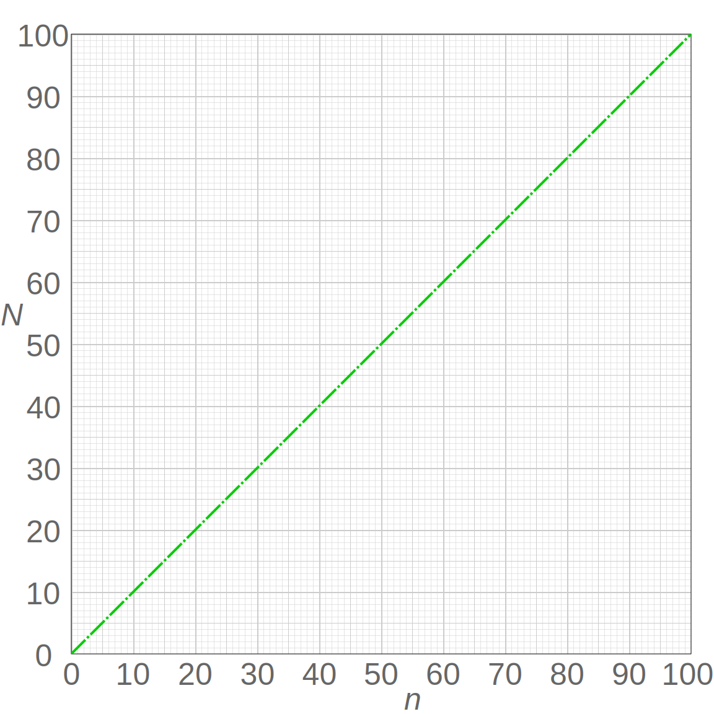
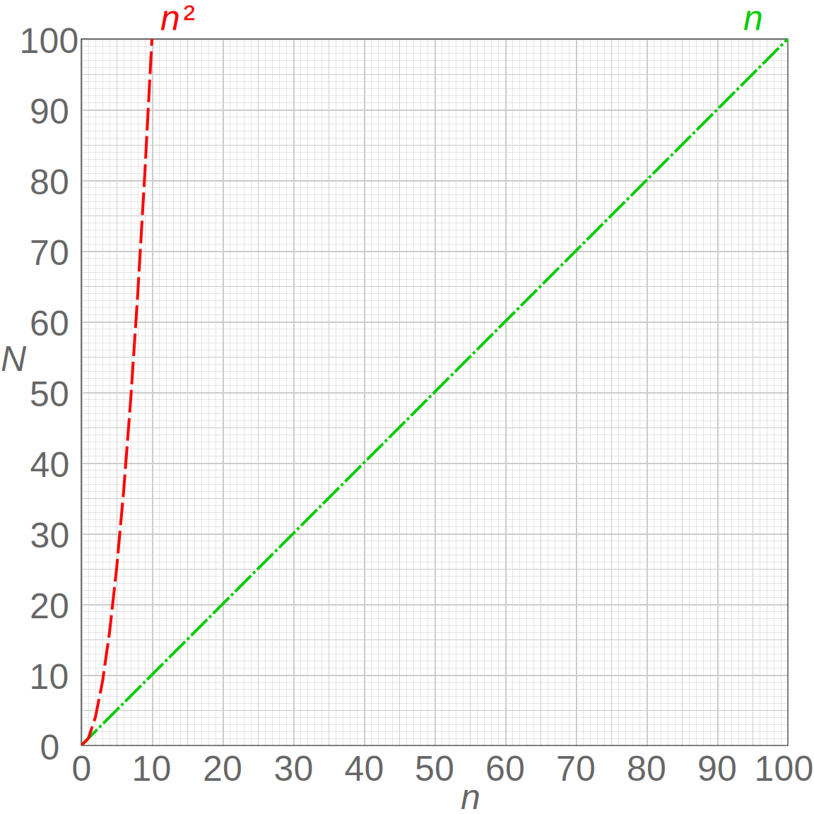

# Input size and efficiency

#### Quiz 1:

Here's one of our functions from the last page:

```python
def some_function(n):
    for i in range(2):
        n += 100
    return n
```

Suppose we call this function and give it the value `1`, like this:

```python
some_function(1)
```

And then we call it again, but give it the input `1000`:

`some_function(1000)`

Will this change the number of lines of code that get run?

Answer: `No - the same number of lines will run in both cases.`

#### Quiz 2:

Now, here's a new function:

```python
def say_hello(n):
    for i in range(n):
        print("Hello!")
```

Suppose we call it like this:

```python
say_hello(3)
```

And then we call it like this:

```python
say_hello(1000)
```

Answer: `Yes - say_hello(1000) will involve running more lines of code`

This highlights a key idea:

> As the input to an algorithm increases, the time required to run the algorithm may also increase.

Notice that we said *may* increase. As we saw with the above examples, input size sometimes affects the run-time of the program and sometimes doesn't—it depends on the program.

## The rate of increase

#### Quiz 3:

Let's look again at this function from above:

```python
def say_hello(n):
    for i in range(n):
        print("Hello!")
```

Below are some different function calls. Match each one with the number of lines of code that will get run.


| Function Calls| How many lines get run ? |
| ------------- |-------------:|
| say_hello(1)      | 3 |
| say_hello(2)      | 4 |
| say_hello(3) | 5 |
| say_hello(4) | 6 |

#### Quiz 4:

Here's another question about that same function (from the above exercise). When we increase the size of the input `n` by 1, how many more lines of code get run?

Answer: `When n goes up by 1, the number of lines run also goes up by 1`

So here's one thing that we know about this function: As the input increases, the number of lines executed also increases.

But we can go further than that! We can also say that *as the input increases, the number of lines executed increases by a proportional amount*. Increasing the input by 1 will cause 1 more line to get run. Increasing the input by 10 will cause 10 more lines to get run. Any change in the input is tied to a consistent, proportional change in the number of lines executed. This type of relationship is called a linear relationship, and we can see why if we graph it:



The horizontal axis, n, represents the size of the input (in this case, the number of times we want to print "Hello!").

The vertical axis, N, represents the number of operations that will be performed. In this case, we're thinking of an "operation" as a single line of Python code (which is not the most accurate, but it will do for now).

We can see that if we give the function a larger input, this will result in more operations. And we can see the rate at which this increase happens—the rate of increase is **linear**. Another way of saying this is that the number of operations **increases at a constant rate**.

If that doesn't quite seem clear yet, it may help to contrast it with an alternative possibility—a function where the operations increase at a rate that is not constant.


Now here's a slightly modified version of the `say_hello` function:

```python
def say_hello(n):
    for i in range(n):
        for i in range(n):
            print("Hello!")
```

Notice that it has a nested loop (a for loop inside another for loop!).

#### Quiz 5:
Below are some function calls. Match each one with the number of times "Hello!" will get printed.

| Function Calls| How many lines get run ? |
| ------------- |-------------:|
| say_hello(1)      | 1 |
| say_hello(2)      | 4 |
| say_hello(3) | 9 |
| say_hello(4) | 16 |


#### Quiz 6:
Looking at the `say_hello` function from the above exercise, what can we say about the relationship between the input, `n`, and the `number of times` the function will `print "Hello!"`?

Answer: the function will print `"Hello"` **exactly n-squared times**, so `say_hello(2)` will print "Hello!" four times.

Notice that when the input goes up by a certain amount, the number of operations goes up by the square of that amount. If the input is 2, the number of operations is 2<sup>2</sup> or 4. If the input is 3, the number of operations is 3<sup>2</sup> or 9.

To state this in general terms, if we have an input, n, then the number of operations will be n<sup>2</sup>. This is what we would call a **quadratic** rate of increase.

Let's compare that with the **linear** rate of increase. In that case, when the input is n, the number of operations is also n.

Let's graph both of these rates so we can see them together:




Our code with the **nested for loop** exhibits the **quadratic** n<sup>2</sup>
relationship on the left. Notice that this results in a much faster rate of increase. As we ask our code to print larger and larger numbers of "Hellos!", the number of operations the computer has to perform shoots up very quickly—much more quickly than our other function, which shows a **linear** increase.

This brings us to a second key point. We can add it to what we said earlier:

>As the input to an algorithm increases, the time required to run the algorithm may also increase— **and different algorithms may increase at different rates**.

Notice that if `n` is very small, it doesn't really matter which function we use—but as we put in larger values for `n`, the function with the nested loop will quickly become far less efficient.

We've looked here only at a couple of different rates—linear and quadratic. But there are many other possibilities. Here we'll show some of the common types of rates that come up when designing algorithms:


We'll look at some of these other `orders` as we go through the class. But for now, notice how dramatic a difference there is here between them! Hopefully you can now see that this idea of the **order or rate of increase in the run-time of an algorithm is an essential concept when designing algorithms**.

## Order
We should note that when people refer to the rate of increase of an algorithm, they will sometimes instead use the term **order**. Or to put that another way:

>The **rate of increase** of an algorithm is also referred to as the **order** of the algorithm.

For example, instead of saying "this relationship has a linear rate of increase", we could instead say, **"the order of this relationship is linear"**.

On the next page, we'll introduce something called **Big O Notation**, and you'll see that the **"O"** in the name refers to the order of the rate of increase.
