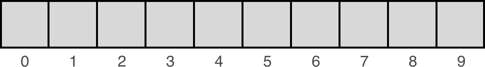

# Arrays vs. lists vs. Python lists
The distinction between arrays and lists can be a little confusing, especially because of how Python implements the data structure it calls a "list". Below, we'll go over some key points that should make this clearer.

## Arrays
An array has some things in common with a list. In both cases:

There is a collection of items
The items have an order to them
But one of the key differences is that *arrays have indexes, while lists do not*.

To understand this, it helps to know how arrays are stored in memory. When an array is created, it is always given some initial size—that is, the number of elements it should be able to hold (and how large each element is). The computer then finds a block of memory and sets aside the space for the array.

Importantly, the space that gets set aside is one, continuous block. That is, all of the elements of the array are contiguous, meaning that they are all next to one another in memory.

Another key characteristic of an array is that all of the elements are the same size.

When we represent an array visually, we often draw it as a series of boxes that are all of the same size and all right next to one another:


Because all of the elements are (1) next to one another and (2) the same size, this means that if we know the location of the first element, we can calculate the location of any other element.

For example, if the first element in the array is at memory location **00** and the elements are `24` bytes, then the next element would be at location `00 + 24 =` **24**. And the one after that would be at 24 + 24 = 48, and so on.

Since we can easily calculate the location of any item in the array, we can assign each item an index and use that index to quickly and directly access the item.



## Lists
In contrast, the elements of a list may or may not be next to one another in memory! For example, later in this lesson we'll look at linked lists, where each list item points to the next list item—but where the items themselves may be scattered in different locations of memory. In this case, knowing the location of the first item in the list does not mean you can simply calculate the location of the other items. This means we cannot use indexes to directly access the list items as we would in an array. We'll explore linked lists in more detail shortly.

## Python lists
In Python, we can create a list using square brackets `[ ]`. For example:

```python
>>> my_list = ['a', 'b', 'c']
>>> my_list
['a', 'b', 'c']
```

And then we can access an item in the list by providing an index for that item:

```python
>>> my_list[0]
'a'
>>> my_list[1]
'b'
>>> my_list[2]
'c'
```

But wait, didn't we just say that lists don't have indexes!? This seems to directly contradict that distinction.

The reason for this confusion is simply one of terminology. The earlier description we gave of lists is correct in `general` —that is, usually when you hear someone refer to something as a `"list"`, that is what they mean. However, in **Python the term is used differently**.

We will not get into all of the details, but the important thing you need to know for this course is the following: If you were to look under the hood, you would find that a **Python list is essentially implemented like an array** (specifically, **it behaves like a dynamic array**, if you're curious). In particular, **the elements of a Python list are contiguous in memory, and they can be accessed using an index.**

In addition to the underlying array, a Python list also includes some additional **behavior**. For example, you can use things like **pop** and **append** methods on a Python list to add or remove items. Using those methods, you can essentially utilize a Python list like a **stack** (which is another type of data structure we'll discuss shortly).

In general, we will try to avoid using things like **pop** and **append**, because these are high-level language features that may not be available to you in other languages. In most cases, we will ignore the extra functionality that comes with Python lists, and instead use them as if they were simple arrays. This will allow you to see how the underlying data structures work, regardless of the language you are using to implement those structures.

Here's the bottom line:

- Python lists are essentially arrays, but also include additional high-level functionality
- During this course, we will generally ignore this high-level functionality and treat Python lists as if they were simple arrays

This approach will allow you to develop a better understanding for the underlying data structures.
