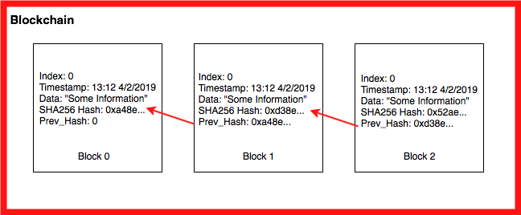

# Problem 1: Least Recently Used Cache
We have briefly discussed caching as part of a practice problem while studying hash maps.

The lookup operation (i.e., get()) and put() / set() is supposed to be fast for a cache memory.

While doing the get() operation, if the entry is found in the cache, it is known as a cache hit. If, however, the entry is not found, it is known as a cache miss.

When designing a cache, we also place an upper bound on the size of the cache. If the cache is full and we want to add a new entry to the cache, we use some criteria to remove an element. After removing an element, we use the put() operation to insert the new element. The remove operation should also be fast.

For our first problem, the goal will be to design a data structure known as a Least Recently Used (LRU) cache. An LRU cache is a type of cache in which we remove the least recently used entry when the cache memory reaches its limit. For the current problem, consider both get and set operations as an use operation.

Your job is to use an appropriate data structure(s) to implement the cache.

In case of a cache hit, your get() operation should return the appropriate value.
In case of a cache miss, your get() should return -1.
While putting an element in the cache, your put() / set() operation must insert the element. If the cache is full, you must write code that removes the least recently used entry first and then insert the element.
All operations must take O(1) time.

For the current problem, you can consider the size of cache = 5.

Here is some boiler plate code and some example test cases to get you started on this problem:

```python
class LRU_Cache(object):

    def __init__(self, capacity):
        # Initialize class variables
        pass

    def get(self, key):
        # Retrieve item from provided key. Return -1 if nonexistent.
        pass

    def set(self, key, value):
        # Set the value if the key is not present in the cache. If the cache is at capacity remove the oldest item.
        pass

our_cache = LRU_Cache(5)

our_cache.set(1, 1);
our_cache.set(2, 2);
our_cache.set(3, 3);
our_cache.set(4, 4);


our_cache.get(1)       # returns 1
our_cache.get(2)       # returns 2
our_cache.get(9)      # returns -1 because 9 is not present in the cache

our_cache.set(5, 5)
our_cache.set(6, 6)

our_cache.get(3)      # returns -1 because the cache reached it's capacity and 3 was the least recently used entry

```
# Problem 2: Finding Files
For this problem, the goal is to write code for finding all files under a directory (and all directories beneath it) that end with ".c"

Here is an example of a test directory listing,

```python
./testdir
./testdir/subdir1
./testdir/subdir1/a.c
./testdir/subdir1/a.h
./testdir/subdir2
./testdir/subdir2/.gitkeep
./testdir/subdir3
./testdir/subdir3/subsubdir1
./testdir/subdir3/subsubdir1/b.c
./testdir/subdir3/subsubdir1/b.h
./testdir/subdir4
./testdir/subdir4/.gitkeep
./testdir/subdir5
./testdir/subdir5/a.c
./testdir/subdir5/a.h
./testdir/t1.c
./testdir/t1.h
```

Python's os module will be useful—in particular, you may want to use the following resources:

os.path.isdir(path)

os.path.isfile(path)

os.listdir(directory)

os.path.join(...)

Note: os.walk() is a handy Python method which can achieve this task very easily. However, for this problem you are not allowed to use os.walk().

Here is some code for the function to get you started:

```python
def find_files(suffix, path):
    """
    Find all files beneath path with file name suffix.

    Note that a path may contain further subdirectories
    and those subdirectories may also contain further subdirectories.

    There are no limit to the depth of the subdirectories can be.

    Args:
      suffix(str): suffix if the file name to be found
      path(str): path of the file system

    Returns:
       a list of paths
    """
    return None
```
OS Module Exploration Code

```python
## Locally save and call this file ex.py ##

# Code to demonstrate the use of some of the OS modules in python

import os

# Let us print the files in the directory in which you are running this script
print (os.listdir("."))

# Let us check if this file is indeed a file!
print (os.path.isfile("./ex.py"))

# Does the file end with .py?
print ("./ex.py".endswith(".py"))
```
# Problem 3: Huffman Coding
A Huffman code is a type of optimal prefix code that is used for compressing data. The Huffman encoding and decoding schema is also lossless, meaning that when compressing the data to make it smaller, there is no loss of information.

The Huffman algorithm works by assigning codes that correspond to the relative frequency of each character for each character. The Huffman code can be of any length and does not require a prefix; therefore, this binary code can be visualized on a binary tree with each encoded character being stored on leafs.

There are many types of pseudocode for this algorithm. At the basic core, it is comprised of building a Huffman tree, encoding the data, and, lastly, decoding the data.

Here is one type of pseudocode for this coding schema:

Take a string and determine the relevant frequencies of the characters.
Build and sort a list of tuples from lowest to highest frequencies.
Build the Huffman Tree by assigning a binary code to each letter, using shorter codes for the more frequent letters. (This is the heart of the Huffman algorithm.)
Trim the Huffman Tree (remove the frequencies from the previously built tree).
Encode the text into its compressed form.
Decode the text from its compressed form.
You then will need to create encoding, decoding, and sizing schemas.

For Example:
```python
import sys

def huffman_encoding(data):
    pass

def huffman_decoding(data,tree):
    pass

if __name__ == "__main__":
    codes = {}

    a_great_sentence = "The bird is the word"

    print ("The size of the data is: {}\n".format(sys.getsizeof(a_great_sentence)))
    print ("The content of the data is: {}\n".format(a_great_sentence))

    encoded_data, tree = huffman_encoding(a_great_sentence)

    print ("The size of the encoded data is: {}\n".format(sys.getsizeof(int(encoded_data, base=2))))
    print ("The content of the encoded data is: {}\n".format(encoded_data))

    decoded_data = huffman_decoding(encoded_data, tree)

    print ("The size of the decoded data is: {}\n".format(sys.getsizeof(decoded_data)))
    print ("The content of the encoded data is: {}\n".format(decoded_data))
```
# Problem 4: Active Directory
In Windows Active Directory, a group can consist of user(s) and group(s) themselves. We can construct this hierarchy as such. Where User is represented by str representing their ids.

```python
class Group(object):
    def __init__(self, _name):
        self.name = _name
        self.groups = []
        self.users = []

    def add_group(self, group):
        self.groups.append(group)

    def add_user(self, user):
        self.users.append(user)

    def get_groups(self):
        return self.groups

    def get_users(self):
        return self.users

    def get_name(self):
        return self.name


parent = Group("parent")
child = Group("child")
sub_child = Group("subchild")

sub_child_user = "sub_child_user"
sub_child.add_user(sub_child_user)

child.add_group(sub_child)
parent.add_group(child)
```
Write a function that provides an efficient look up of whether the user is in a group.

```python
def is_user_in_group(user, group):
    """
    Return True if user is in the group, False otherwise.

    Args:
      user(str): user name/id
      group(class:Group): group to check user membership against
    """
    return None
```

# Problem 5: Blockchain
A Blockchain is a sequential chain of records, similar to a linked list. Each block contains some information and how it is connected related to the other blocks in the chain. Each block contains a cryptographic hash of the previous block, a timestamp, and transaction data. For our blockchain we will be using a SHA-256 hash, the Greenwich Mean Time when the block was created, and text strings as the data.

Use your knowledge of linked lists and hashing to create a blockchain implementation.



First  is the information hash:

```python
import hashlib

def calc_hash(self):
      sha = hashlib.sha256()

      hash_str = "We are going to encode this string of data!".encode('utf-8')

      sha.update(hash_str)

      return sha.hexdigest()
```
We do this for the information we want to store in the block chain such as transaction time, data, and information like the previous chain.

The next main component is the block on the blockchain:

```python
class Block:

    def __init__(self, timestamp, data, previous_hash):
      self.timestamp = timestamp
      self.data = data
      self.previous_hash = previous_hash
      self.hash = self.calc_hash()
```
Above is an example of attributes you could find in a Block class.

Finally you need to link all of this together in a block chain, which you will be doing by implementing it in a linked list. All of this will help you build up to a simple but full blockchain implementation!

# Problem 6: Union and Intersection of Two Linked Lists
Your task for this problem is to fill out the union and intersection functions. The union of two sets A and B is the set of elements which are in A, in B, or in both A and B. The intersection of two sets A and B, denoted by A ∩ B, is the set of all objects that are members of both the sets A and B.

You will take in two linked lists and return a linked list that is composed of either the union or intersection, respectively. Once you have completed the problem you will create your own test cases and perform your own run time analysis on the code.

We have provided a code template below, you are not required to use it:

```python
class Node:
    def __init__(self, value):
        self.value = value
        self.next = None

    def __repr__(self):
        return str(self.value)


class LinkedList:
    def __init__(self):
        self.head = None

    def __str__(self):
        cur_head = self.head
        out_string = ""
        while cur_head:
            out_string += str(cur_head.value) + " -> "
            cur_head = cur_head.next
        return out_string


    def append(self, value):

        if self.head is None:
            self.head = Node(value)
            return

        node = self.head
        while node.next:
            node = node.next

        node.next = Node(value)

    def size(self):
        size = 0
        node = self.head
        while node:
            size += 1
            node = node.next

        return size

def union(llist_1, llist_2):
    # Your Solution Here
    pass

def intersection(llist_1, llist_2):
    # Your Solution Here
    pass


# Test case 1

linked_list_1 = LinkedList()
linked_list_2 = LinkedList()

element_1 = [3,2,4,35,6,65,6,4,3,21]
element_2 = [6,32,4,9,6,1,11,21,1]

for i in element_1:
    linked_list_1.append(i)

for i in element_2:
    linked_list_2.append(i)

print (union(linked_list_1,linked_list_2))
print (intersection(linked_list_1,linked_list_2))

# Test case 2

linked_list_3 = LinkedList()
linked_list_4 = LinkedList()

element_1 = [3,2,4,35,6,65,6,4,3,23]
element_2 = [1,7,8,9,11,21,1]

for i in element_1:
    linked_list_3.append(i)

for i in element_2:
    linked_list_4.append(i)

print (union(linked_list_3,linked_list_4))
print (intersection(linked_list_3,linked_list_4))
```
