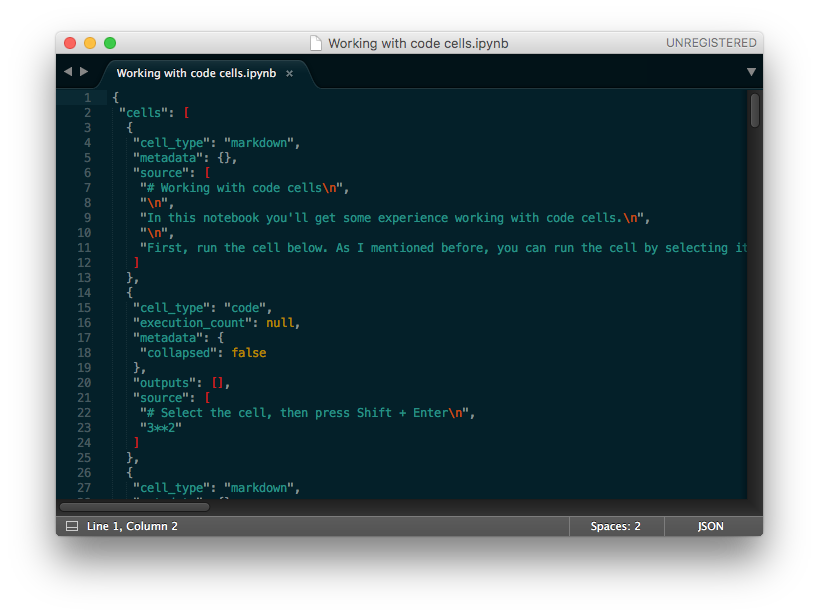
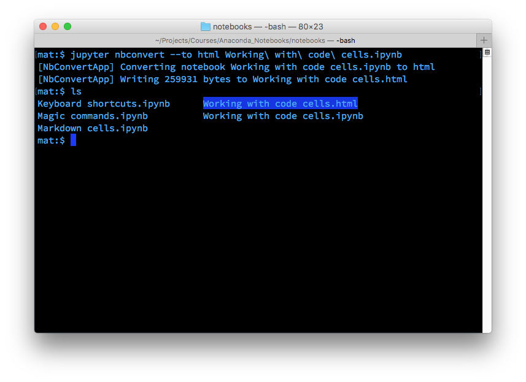

# Converting notebooks
Notebooks are just big [JSON](https://www.json.org/json-en.html) files with the extension `.ipynb`. So let's see what this format looks like if we open it with a text editor like Atom.


*Notebook file opened with a text editor showing JSON data*

Since notebooks are JSON, it is simple to convert them to other formats. Jupyter comes with a utility called `nbconvert` for converting to HTML, Markdown, slideshows, etc.

For example, to convert a notebook to an HTML file, in your terminal use

```console
$ jupyter nbconvert --to html notebook.ipynb
```

Converting to HTML is useful for sharing your notebooks with others who aren't using notebooks. Markdown is great for including a notebook in blogs and other text editors that accept Markdown formatting.



Learn more about `nbconvert` from the [documentation](https://nbconvert.readthedocs.io/en/latest/usage.html).

## Note

The notebook interface provides a simple way to export the notebooks in different formats. You can export a notebook in **HTML**, **Markdown**, **slideshows**, etc..
In the menu bar click `File` > `Download as` to bring up all the available exporting formats.
