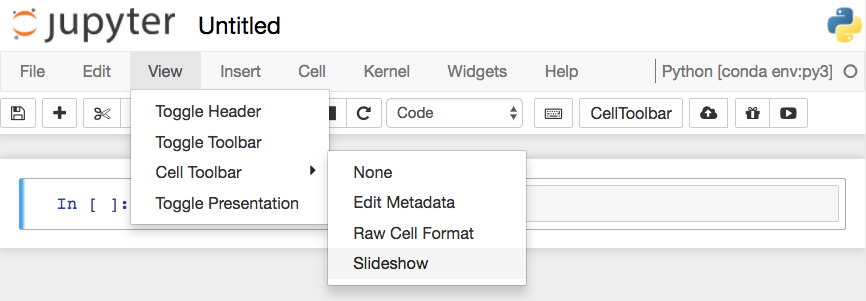
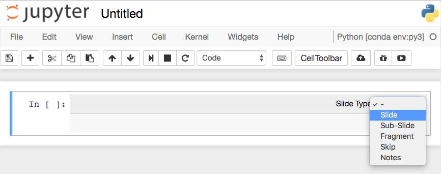

# Creating a slideshow
Create slideshows from notebooks is one of my favorite features. You can see an example of a slideshow [here](https://nbviewer.jupyter.org/format/slides/github/jorisvandenbossche/2015-PyDataParis/blob/master/pandas_introduction.ipynb#/) introducing pandas for working with data.

The slides are created in notebooks like normal, but you'll need to designate which cells are slides and the type of slide the cell will be. In the menu bar, click View > Cell Toolbar > Slideshow to bring up the slide cell menu on each cell.


*Turning on Slideshow Toolbars for cells*

This will show a menu dropdown on each cell that lets you choose how the cell shows up in the slideshow.


*Choose slide type*

**Slides** are full slides that you move through left to right. **Sub-slides** show up in the slideshow by pressing up or down. **Fragments** are hidden at first, then appear with a button press. You can skip cells in the slideshow with **Skip** and **Notes** leaves the cell as speaker notes.

Running the slideshow
To create the slideshow from the notebook file, you'll need to use `nbconvert`:

```console
$ jupyter nbconvert notebook.ipynb --to slides
```
This just converts the notebook to the necessary files for the slideshow, but you need to serve it with an HTTP server to actually see the presentation.

To convert it and immediately see it, use

```console
$ jupyter nbconvert notebook.ipynb --to slides --post serve
```

This will open up the slideshow in your browser so you can present it.
